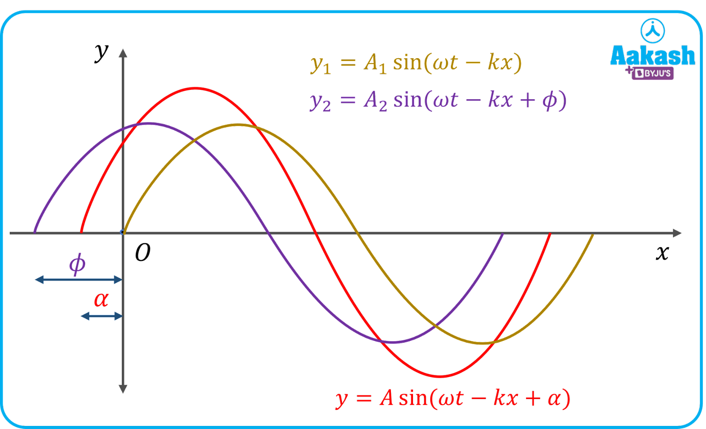

<!-- _header: "Научный доклад" -->
<!-- _footer: "МФТИ | Долгопрудный, 2023г." -->
# Снижение размерности нелинейных динамических систем с управлением и неоднородностями методами анализа данных

**Елизарьев** Максим Андреевич | А01-902в

**09.06.01** Информатика и вычислительная техника
**1.2.2**   Математическое моделирование, численные методы и комплексы программ

**Научный руководитель**
Хлюпин Алексей Николаевич | кандидат физ.-мат. наук

---

- [Общая характеристика работы](#общая-характеристика-работы)
- [Определяющие уравнения](#определяющие-уравнения)
- [Снижение размерности с помощью данных](#снижение-размерности-с-помощью-данных)
- [Обратные задачи нефтегазового моделирования](#обратные-задачи-нефтегазового-моделирования)
- [Заключение](#заключение)

---

## Общая характеристика работы

<!-- - Актуальность, цели и задачи
- Теоретическая и практическая значимость
- Основные положения -->
---

### Актуальность

**Нефтегазовое моделирование**

- Высокая вычислительная сложность
- Решение обратных задач

**Прокси-моделирование**

- Скорость построения и расчётов
- Детализация
- Следование определяющим уравнениям
- Область применимости
- Закономерности в данных
---

#### Анализ данных в моделировании

- Суррогатные модели
  - Обобщающая способность
  - Предсказуемость точности
- Доступность и качество данных

#### Предмет исследования

Методы **эмпирического снижения размерности**
нелинейных динамических моделей

---

TODO: Carlberg, ускорение моделирования

---

### Цели

### Задачи

---

### Научная новизна

### Практическая значимость

---

### Основные положения

---

### Апробация

---

### Публикации

---

## Определяющие уравнения

---

### Модельные задачи

---

### Система уравнений чёрной нефти

---

## Снижение размерности с помощью данных

---

### Правильное ортогональное разложение

#### Сходимость низкоразмерных моделей

---

### Эмпирическая интерполяция нелинейных функций

#### Предварительное вычисление линейных операторов

---

### Эмпирические динамические моды

---

## Обратные задачи нефтегазового моделирования

### Оптимизация расположения скважин

### Адаптация исторических данных

---

## Заключение

TODO Развитие темы

---

### Спасибо!<!-- fit -->

**Снижение размерности нелинейных динамических систем
с управлением и неоднородностями методами анализа данных**

**Елизарьев** Максим Андреевич | А01-902в
