<!-- _header: "Научный доклад" -->
<!-- _footer: "МФТИ | Долгопрудный, 2023г." -->
# Снижение размерности нелинейных динамических систем с управлением и неоднородностями методами анализа данных

**Елизарьев** Максим Андреевич | А01-902в

**09.06.01** Информатика и вычислительная техника
**1.2.2**   Математическое моделирование, численные методы и комплексы программ

**Научный руководитель**
Хлюпин Алексей Николаевич | кандидат физ.-мат. наук

---

- [Общая характеристика работы](#общая-характеристика-работы)
- [Определяющие уравнения](#определяющие-уравнения)
- [Снижение размерности с помощью данных](#снижение-размерности-с-помощью-данных)
- [Обратные задачи нефтегазового моделирования](#обратные-задачи-нефтегазового-моделирования)
- [Заключение](#заключение)

---

## Общая характеристика работы

<!-- - Актуальность, цели и задачи
- Теоретическая и практическая значимость
- Основные положения -->
---

### Актуальность

**Нефтегазовое моделирование**

- Высокая вычислительная сложность
- Решение обратных задач

**Прокси-моделирование**

- Скорость построения и расчётов
- Детализация
- Следование определяющим уравнениям
- Область применимости
- Закономерности в данных

---

#### Анализ данных в моделировании

- Суррогатные модели
  - Обобщающая способность
  - Предсказуемость точности
- Доступность и качество данных

#### Предмет исследования

Методы **эмпирического снижения размерности**
нелинейных динамических моделей

---

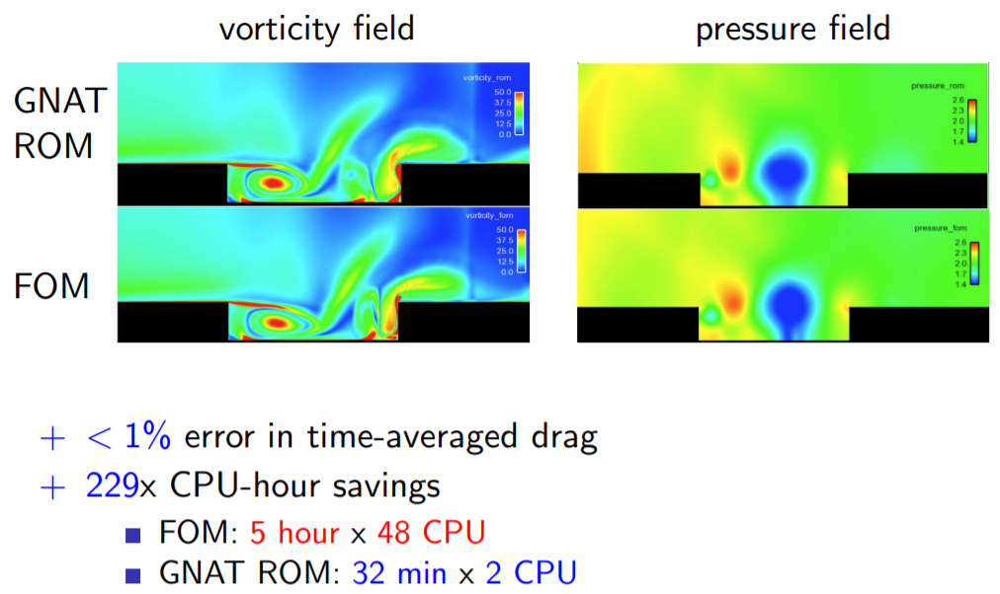
Эмпирическое снижение размерности в вычислительной гидродинамике
(Kevin Carlberg)

---

### Цели

Развитие методов и подходов к эмпирическому снижению размерности
для эффективного нефтегазового моделирования.

### Задачи

- Анализ существующих исследований и разработок, определение проблематики
- Анализ применимости методов для моделирования фильтрации
- Разработка алгоритмов с большей обобщающей способностью
- Сформулировать подход к дизайну прикладного ПО

---

### Основные положения

- Иерархический метод построения низкоразмерных моделей многофазной нелинейной фильтрации
- Подход к выбору нелинейных функций для эмпирической аппроксимации
- Сопоставимый критерий сходимости для полноразмерных и низкоразмерных моделей.
<!-- - Метод предобуславливания нелинейной задачи с помощью извлечения динамических мод из данных -->
- Метод кусочных инвариантных преобразований координат для низкоразмерного представления нелинейных фундаментальных решений

---

### Научная новизна

- Проведён аналитический обзор существующих методов
- Сформулирована проблематика пространства параметров в обратном нефтегазовом моделировании
- Расширена применимость существующих методов на с использованием свойств преобразований координат и фундаментальных решений

### Практическая значимость

- Предлагается подход к работе с данными в реальных сценариях
- Метрика сходимости переиспользует критерии для полноразмерных моделей
- Разработаны модули для **MATLAB Reservoir Simulation Toolbox** (MRST)
---

### Публикации и конференции

1. Elizarev, M. (2019, September). **Numerical Simulation of Multiphase Non-Darcy Flows: Generalized Approach.** *In SPE Annual Technical Conference and Exhibition. OnePetro.*
2. Mukhin, A., Elizarev, M., Voskresenskiy, N., & Khlyupin, A. (2020). **Application of dynamic parametrization algorithm for non-intrusive history matching approaches.** *ECMOR XVII, 2020(1), 1-13.*
3. Elizarev, M., Mukhin, A., & Khlyupin, A. (2021). **Objective-sensitive principal component analysis for high-dimensional inverse problems.** *Computational Geosciences, 25, 2019-2031.*
4. Elizarev, M., & Khlyupin, A. (2022). **Efficient Dimensionality Reduction of Nonlinear Fundamental Solution for Well Placement Optimization.** *ECMOR 2022, 2022(1), 1-15.*

---

## Определяющие уравнения

и их свойства

---

### Система уравнений чёрной нефти

$$
\frac{\partial}{\partial t}\left(
    \textcolor{purple}{\varphi} \mathrm{R}_{\alpha A} \frac{s_A}{b_A}
\right) - \overrightarrow{\nabla} \left[
    \mathrm{R}_{\alpha A} \left(
        \textcolor{purple}{K}\frac{\kappa_A}{\mu_A b_A}\nabla p
    \right)
\right]
= \mathrm{R}_{\alpha A}
\frac{2\pi K \kappa_A}{\mu_A b_A \ln(r_c r_\text{well}^{-1})}
\left(p - \textcolor{green}{p_\text{well}}\right)
$$

$$
\sum_A s_A = 1
$$

- нелинейная динамика
- неоднородная среда
- точечное управляющее воздействие

---

### Нелинейная диффузия

$$
   u(x,t): \frac{\partial u}{\partial t} - \frac{\partial}{\partial x} \left[\textcolor{purple}{\kappa}(x) \textcolor{red}{\eta}(u) \frac{\partial u}{\partial x}  \right]= q \delta (x - \textcolor{green}{x_q})
$$

- нелинейная динамика
- неоднородная среда
- точечное управляющее воздействие
---

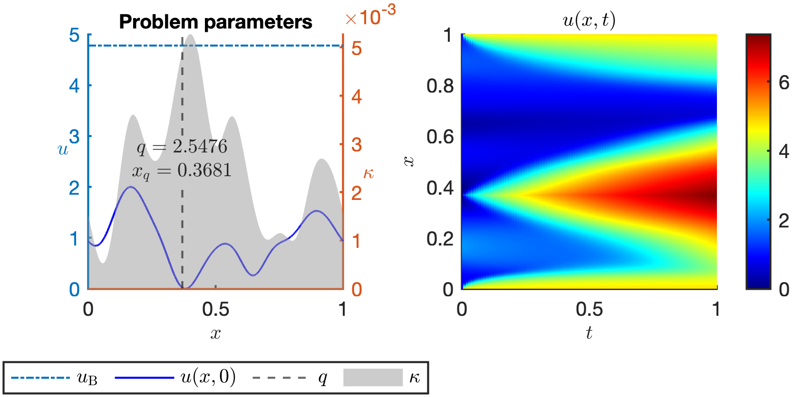
Постановка и решение характерной задачи

---
### Абстрактная нелинейная задача

Конечно-разностная динамическая задача
c параметрами $\mathbf{\mu}$ и начальным условием $\mathbf{u}_{0}$

$$
{\mathbf{u}_n} = \arg \min_{\mathbf{u}}
\left\|\mathbf{r}_n(\mathbf{u},\mathbf{u}_{n-1};\mathbf{\mu})\right\|
$$

Итерация метода Ньютона дискретизованной задачи

$$
{\Delta \mathbf{u}}_\ast = \arg \min_{{\Delta \mathbf{u}}}
\left\|{\mathbf{r}(\mathbf{u}) + \mathrm{J}(\mathbf{u}) {\Delta \mathbf{u}}}\right\|
$$
---

## Снижение размерности с помощью данных

---

### Правильное ортогональное разложение

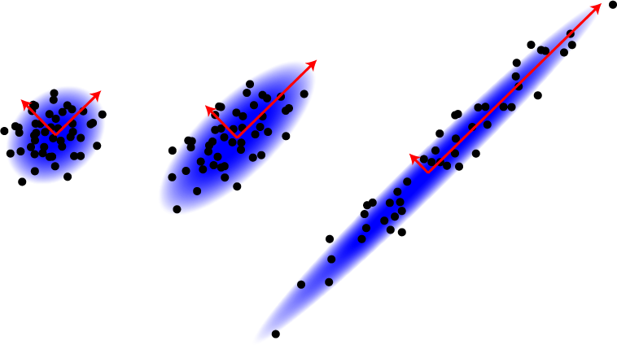

Сингулярное разложение матрицы данных
$$
\mathrm{U}(\mu) = \left[ \mathbf{u}_0, \dots,  \mathbf{u}_{N_t}\right] = \Phi \Sigma \Upsilon^{\text{T}}
$$

**Главные компоненты** (корреляции) в пространстве
$$
\begin{matrix}
\Phi = \left[ \widetilde{\Phi}, \dots\right]
\end{matrix}
$$

Низкоранговая аппроксимация исходных переменных

$$
\mathbf{u}_{\widetilde{\Phi}} = \widetilde{\Phi} \mathbf{v}, \dim{\mathbf{v}} \ll \dim{\mathbf{u}}
$$

---
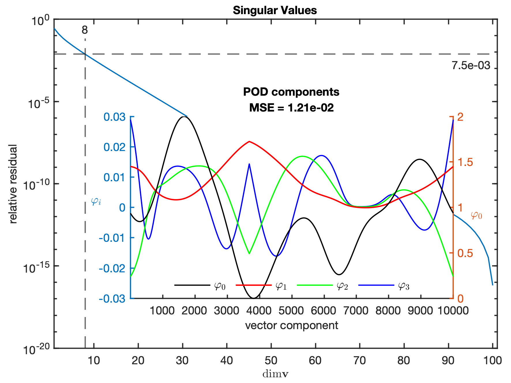

Главные компоненты
нелинейной диффузии
с источником

---

#### Сходимость низкоразмерных моделей

Эмпирически-аппроксимированная нелинейная задача

$$
{\Delta \mathbf{v}}_\ast =
\arg \min_{\Delta \mathbf{v}}
\left\|{\mathbf{r}(\widetilde{\Phi} \mathbf{v})
+ \mathrm{J}(\widetilde{\Phi}  \mathbf{v})
\widetilde{\Phi} {\Delta \mathbf{v}}}\right\|
$$

Проекция переопределённой задачи на подпространство $\mathrm{P}$

$$
\mathrm{P}^{\text{T}} \mathrm{J} \widetilde{\Phi} {\Delta \mathbf{v}} = - \mathrm{P}^{\text{T}} \mathbf{r}
$$

Основные виды проекций
- Галеркина: $\mathrm{P}_{\text{G}} = \widetilde{\Phi}$
- **Линейно-регрессионная** (LSPG): $\mathrm{P}_{\text{LS}} = \mathrm{J} \widetilde{\Phi}$

---

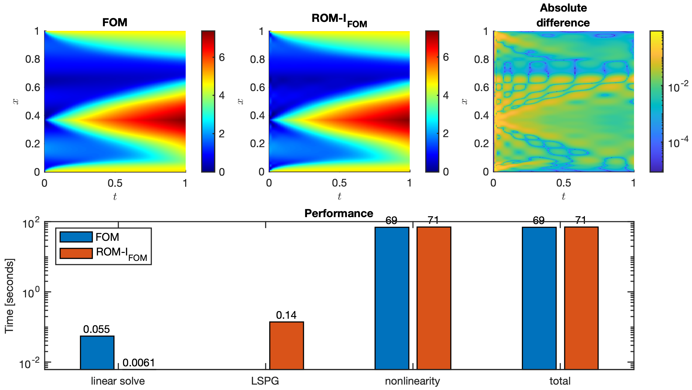
Качество и производительность низкоразмерного представления

---

#### Измерение сходимости

Сходящийся регрессионный процесс
$$
\begin{matrix}
\left\|
    \mathrm{P}^{\text{T}} \mathbf{r}
\right\| \rightarrow 0 &&
\left\|
    \mathbf{r}
\right\| \rightarrow \varepsilon_\text{min} \geqslant 0
\end{matrix}
$$

Исходная метрика сходимости с точностью $\varepsilon$

$$
\left\|
 \mathbf{r} / \dim \mathbf{r}
\right\| = \varepsilon_\text{FOM} \leqslant \varepsilon
$$

Адаптированная **сопоставимая** метрика $\varepsilon$

$$
\left\|
  \mathrm{P}^{\text{T}}_\text{G} \mathbf{r} / \dim \mathbf{v}
\right\| = \varepsilon_\text{ROM} \leqslant \varepsilon
$$

---

### Эмпирическая интерполяция нелинейных функций

Вычисление полноразмерных нелинейных функций

$$
{\Delta \mathbf{v}}_\ast =
\arg \min_{\Delta \mathbf{v}}
\left\|{\mathbf{r}(\widetilde{\Phi} \mathbf{v})
+ \mathrm{J}(\widetilde{\Phi}  \mathbf{v})
\widetilde{\Phi} {\Delta \mathbf{v}}}\right\|
$$

---

Главные компоненты нелинейной функции $\mathbf{g}(\mathbf{u})$
$$
\mathcal{F} = \left[
\mathbf{f}_1, \dots
\right] \rightarrow
\widetilde{\Phi}_\mathcal{F}
$$

**Подпространство нелинейных измерений** $\mathrm{P}$

Подмножество компонент вектора $\mathbf{g}$, вычисляемых *непосредственно*.
$\mathrm{P}$ — подмножество соответствующих базисных векторов.

Проекция на подпространство — применение маски
$$
\overline{\mathbf{f}} = \mathrm{P}^\text{T} \mathbf{f}
$$

---

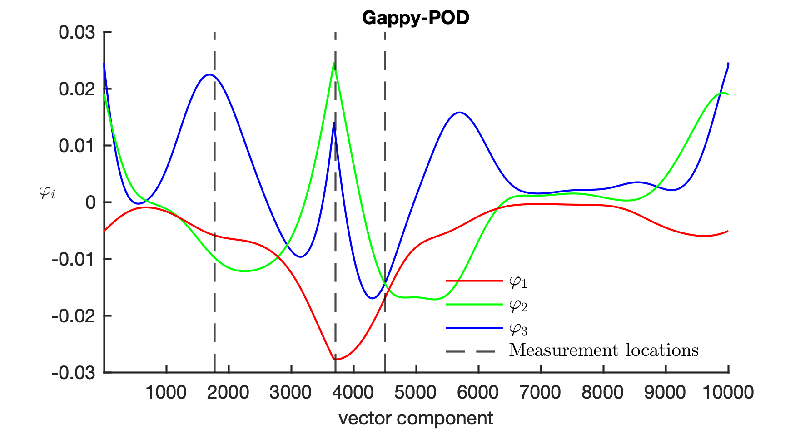

Пример подпространства нелинейных измерений

---

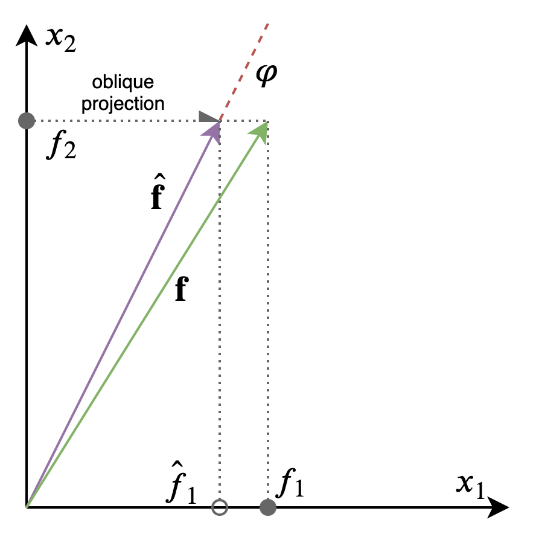

#### Эмпирическая интерполяция косыми проекциями

$$
\widehat{\mathbf{g}} = \arg \min_\mathbf{g}
\left\|
\mathrm{P}^\text{T} \widetilde{\Phi}_\mathcal{F} \mathbf{g} - \overline{\mathbf{f}}
\right\|
$$
Косая проекция из $\widetilde{\Phi}_\mathcal{F}$ ортогонально на $\mathrm{P}$

$$
\widehat{\mathbf{f}}(\overline{\mathbf{f}})
= \widetilde{\Phi}_\mathcal{F}(\mathrm{P}^\text{T} \widetilde{\Phi}_\mathcal{F})^\dagger
\overline{\mathbf{f}} =
\Pi \overline{\mathbf{f}}
$$

---

Низкоразмерная модель с эмпирической аппроксимацией нелинейностей

$$
{\Delta \mathbf{v}}_\ast =
\arg \min_{\Delta \mathbf{v}}
\left\|{\widehat{\mathbf{r}}(\widetilde{\Phi} \mathbf{v})
+ \widehat{\mathrm{J}}(\widetilde{\Phi}  \mathbf{v})
\widetilde{\Phi} {\Delta \mathbf{v}}}\right\|
$$

#### Предварительная свёртка линейных операций

$$
\mathrm{L} \mathbf{f} \rightarrow \mathrm{L} \Pi \overline{\mathbf{f}}  \rightarrow \widehat{\mathrm{L}} \overline{\mathbf{f}}
$$

---

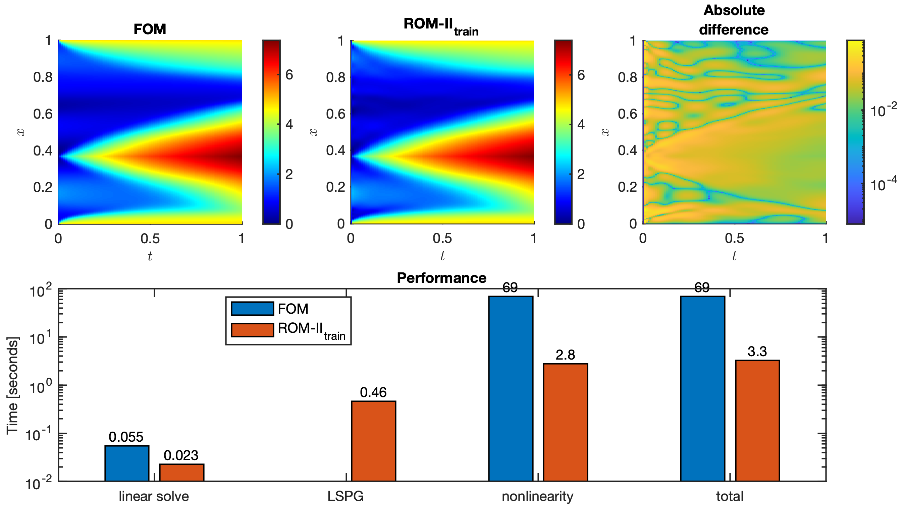
Качество и производительность эмпирической интерполяции нелинейных функций

---

Иерархическая схема эмпирического низкоразмерного моделирования

---

## Обратные задачи нефтегазового моделирования

---

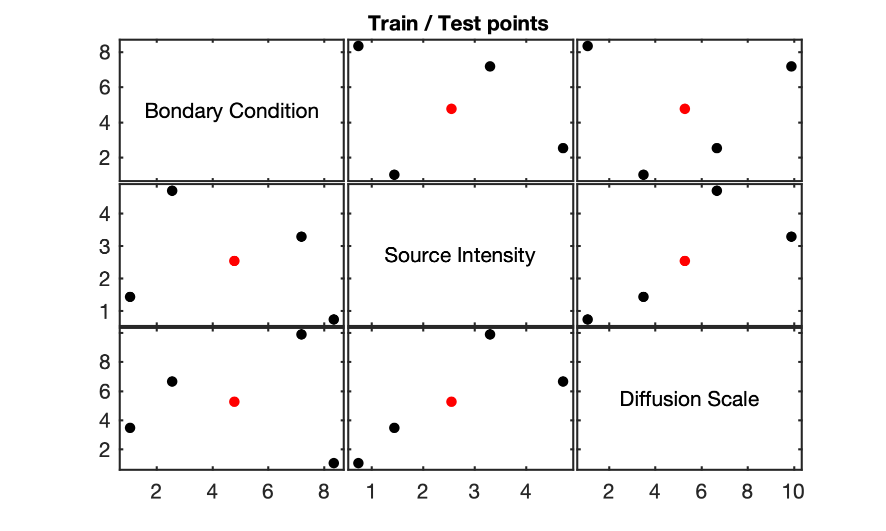
*Фиксированная* пространственная конфигурация: параметры

---

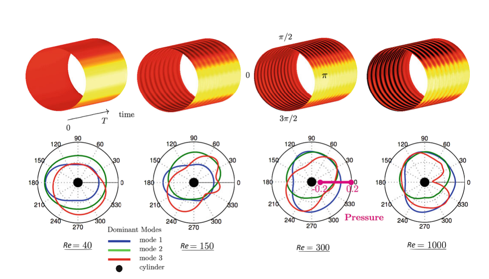
Библиотека главных компонент для параметрических задач
(Steven L. Brunton, J. Nathan Kutz)

---

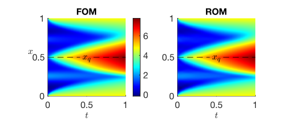
*Фиксированная* пространственная конфигурация:
качество низкоразмерного моделирования

---

### Поиск оптимального расположения скважин

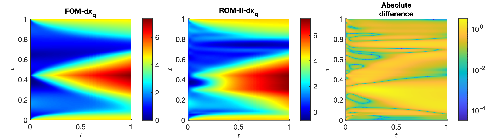
Применимость извлеченных паттернов при смещении источника

---

Ведущая линейная динамика

$$
\frac{\partial u}{\partial t} - \kappa \frac{\partial^2 u}{\partial x^2} = q
$$

Линейное преобразование координат
$$
\begin{matrix}
\frac{\partial \hat{t}}{\partial t} = \alpha
&&
\frac{\partial \hat{x}}{\partial x} = \beta
\end{matrix}
$$

Инвариантность определяющего уравнения

$$
\frac{\partial u}{\partial t} - \textcolor{red}{\frac{\beta^2}{\alpha}} \kappa \frac{\partial^2 u}{\partial x^2} = \frac{q}{\textcolor{red}{\alpha}}
$$

---

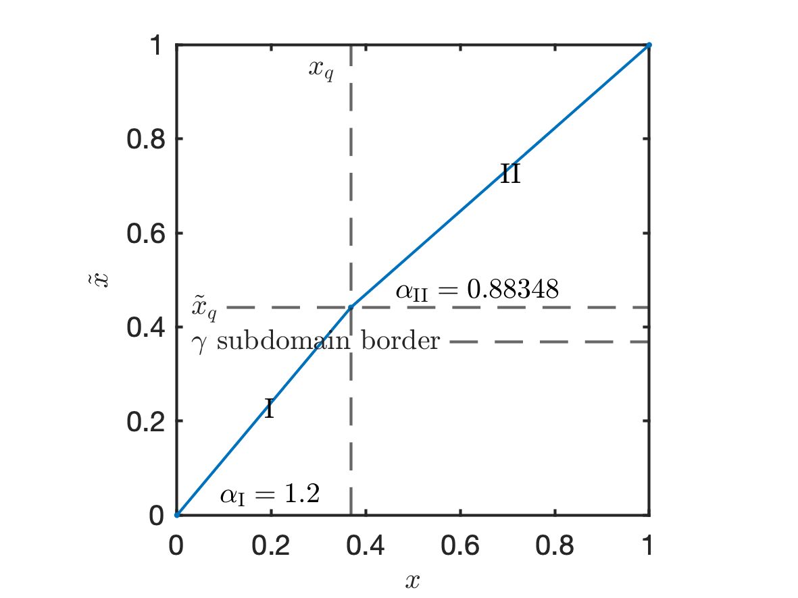

**Кусочно-инвариантные**
преобразования координат

---

<!-- 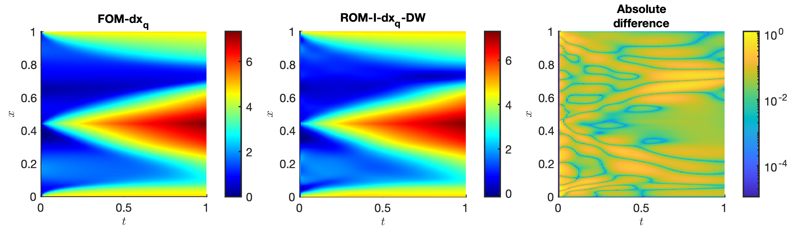 -->
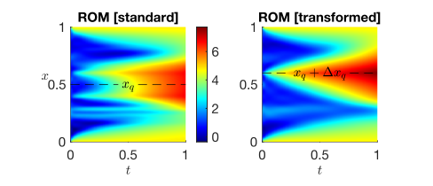

Кусочно-инвариантное преобразование главных компонент
при смещении источника

---

### Определение пространственных свойств

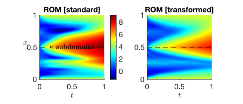
Применение инвариантных преобразований
при кусочно-неоднородных вариациях

---

## Заключение

1. Изучены особенности эмпирического низкоразмерного моделирования в приложении к характерным особенностям моделей пластовых течений
2. Разработан структурированный подход к эмпирическому снижению размерности с интерполяцией нелинейных функций
3. Разработана метрика сходимости низкоразмерных моделей для переиспользования оригинальных критериев сходимости
4. Разработан и реализован принцип кусочно-инвариантных преобразований координат для обобщения извлечённых данных при смещении источниковых членов и неоднородных преобразованиях пространственных свойств
---

Направления развития исследований

- Совместное снижение размерности полей переноса вещества
- Углубленный анализ нелинейных фундаментальных решений:
  поиск глобального нелинейного преобразования координат
- Уточнение подхода к сбору данных в реальных сценариях
- Использование аппарата эмпирической линеаризации
- Использование данных для дополнительного предобуславливания

---

### Спасибо!<!-- fit -->

**Снижение размерности нелинейных динамических систем
с управлением и неоднородностями методами анализа данных**

**Елизарьев** Максим Андреевич | А01-902в
